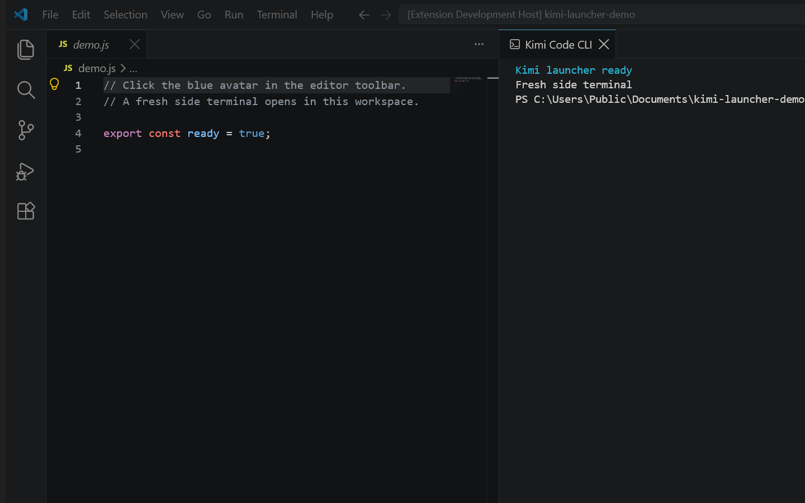

<p align="center">
  
</p>

# Kimi Code CLI Launcher for VS Code

<p align="center">
  <strong>Open Kimi Code CLI in a fresh, workspace-aware side terminal — in one click.</strong>
</p>

<p align="center">
  <a href="https://marketplace.visualstudio.com/items?itemName=mikesoft.vscode-kimi-code-cli-launcher"></a>
  <a href="https://open-vsx.org/extension/mikesoft/vscode-kimi-code-cli-launcher"></a>
  <a href="https://github.com/TheStreamCode/vscode-kimi-code-cli-launcher/actions/workflows/ci.yml"></a>
  <a href="https://github.com/TheStreamCode/vscode-kimi-code-cli-launcher/releases/latest"></a>
  <a href="LICENSE"></a>
</p>

<p align="center">
  <a href="https://marketplace.visualstudio.com/items?itemName=mikesoft.vscode-kimi-code-cli-launcher"><strong>Install from VS Marketplace</strong></a>
  ·
  <a href="https://open-vsx.org/extension/mikesoft/vscode-kimi-code-cli-launcher"><strong>Install from Open VSX</strong></a>
  ·
  <a href="https://github.com/TheStreamCode/vscode-kimi-code-cli-launcher/releases/latest"><strong>Download VSIX</strong></a>
</p>

Kimi Code CLI Launcher is a lightweight, unofficial VS Code extension that starts `kimi` directly from the editor toolbar. Every click opens a new side terminal in the workspace of the active editor. There is no hidden process, automatic installer, sidebar, terminal-output inspection, or telemetry.

> **Unofficial project:** this extension is unofficial and is not affiliated with, endorsed by, or sponsored by Moonshot AI or Kimi. The Kimi name identifies the compatible CLI only. The luminous blue avatar is an independent redraw for this launcher, not an official Kimi asset. See [TRADEMARKS.md](TRADEMARKS.md).

<p align="center">
  
</p>

<p align="center"><sub>Real VS Code Extension Host capture. The terminal text uses a harmless demo command; the launcher never inspects terminal output.</sub></p>

## Quick Start

1. Install Kimi Code CLI from the [official getting-started guide](https://www.kimi.com/code/docs/en/kimi-code-cli/guides/getting-started.html).
2. Confirm that `kimi --version` works in a regular integrated terminal.
3. Install **Kimi Code CLI Launcher** from the [VS Code Marketplace](https://marketplace.visualstudio.com/items?itemName=mikesoft.vscode-kimi-code-cli-launcher) or [Open VSX](https://open-vsx.org/extension/mikesoft/vscode-kimi-code-cli-launcher).
4. Open a project file and click the blue avatar in the editor toolbar.

Each click starts an independent Kimi Code CLI session in a new side terminal.

## Why This Launcher

- One-click access from the editor title toolbar
- A fresh side terminal for every session
- Active-editor workspace selection, with the first workspace as fallback
- User-level-only command configuration; workspace values are ignored
- Workspace Trust enforced even for programmatic command invocation
- No runtime dependencies, telemetry, installers, downloads, or hidden processes
- Windows, macOS, and Linux support through standard VS Code APIs

## Kimi Code CLI Launcher vs. the Official Kimi Code Extension

This project is a terminal-first launcher. It opens the native Kimi Code CLI experience in an integrated terminal; it does not recreate editor chat or agent panels.

The [official Kimi Code extension](https://marketplace.visualstudio.com/items?itemName=moonshot-ai.kimi-code), maintained by Moonshot AI, provides a different editor integration and does not launch Kimi Code CLI in a terminal.

| | This launcher | Official Kimi Code extension |
| --- | --- | --- |
| **Publisher** | Mikesoft, unofficial | Moonshot AI, official |
| **Primary experience** | Native Kimi Code CLI in a side terminal | Official Kimi editor integration |
| **Launches `kimi` in a terminal** | Yes, with one click | No |
| **Terminal sessions** | Fresh terminal on every click | Not provided by the official extension |

## At a Glance

| | Kimi Code CLI Launcher |
| --- | --- |
| **Current release** | `0.1.5` |
| **Extension id** | `mikesoft.vscode-kimi-code-cli-launcher` |
| **Default command** | `kimi` |
| **Working directory** | Workspace of the active editor, then the first open workspace |
| **Available on** | VS Code Marketplace, Open VSX, GitHub Releases |
| **Platforms** | Windows, macOS, and Linux |
| **Privacy** | No telemetry, analytics, or personal-data collection |

## Installation

### VS Code Marketplace

Search for **Kimi Code CLI Launcher**, open the [Marketplace listing](https://marketplace.visualstudio.com/items?itemName=mikesoft.vscode-kimi-code-cli-launcher), or run:

```bash
code --install-extension mikesoft.vscode-kimi-code-cli-launcher
```

### Open VSX

VSCodium, Cursor, Windsurf, and other editors backed by Open VSX can install the same extension id from the [Open VSX listing](https://open-vsx.org/extension/mikesoft/vscode-kimi-code-cli-launcher).

### VSIX from a GitHub release

Download `vscode-kimi-code-cli-launcher-0.1.5.vsix` and its `.sha256` checksum from the [latest GitHub release](https://github.com/TheStreamCode/vscode-kimi-code-cli-launcher/releases/latest), then run:

```bash
code --install-extension vscode-kimi-code-cli-launcher-0.1.5.vsix
```

You can also use **Extensions: Install from VSIX...** from the Command Palette.

## Requirements

- VS Code `^1.103.0` or a compatible editor
- Kimi Code CLI available in the integrated terminal environment
- Git for Windows before the first Kimi launch on Windows

Use the [official Kimi Code CLI guide](https://www.kimi.com/code/docs/en/kimi-code-cli/guides/getting-started.html) for current installation instructions. The official npm alternative requires Node.js 22.19.0 or later:

```bash
npm install -g @moonshot-ai/kimi-code
kimi --version
```

On Windows, Kimi uses the Git Bash bundled with Git for Windows. If Git Bash is installed in a custom location, set `KIMI_SHELL_PATH` to the absolute path of `bash.exe`.

This extension does not install Kimi Code CLI or modify shell configuration. The official Kimi update command is `kimi upgrade`.

## Configuration

| Setting | Scope | Default | Description |
| --- | --- | --- | --- |
| `kimiCodeCliLauncher.cliCommand` | User/machine | `kimi` | Command sent to the new terminal. Workspace values are intentionally ignored. |
| `kimiCodeCliLauncher.terminalName` | Window | `Kimi Code CLI` | Base label for new terminals. |

Open **Kimi Code CLI Launcher: Open Settings** from the Command Palette.

```json
"kimiCodeCliLauncher.cliCommand": "kimi"
```

For a Windows executable path containing spaces:

```json
"kimiCodeCliLauncher.cliCommand": "\"C:\\Program Files\\Kimi Code\\kimi.exe\""
```

Treat the setting as executable code: review it before use and never place API keys or other secrets in it. The launcher reads no `.env` files or credentials. New terminals simply inherit the environment supplied by VS Code; Kimi owns its own login and provider configuration.

## How It Works

Each click creates a new integrated terminal beside the editor and visibly sends the configured command. Existing terminals are never reused or inspected.

The active editor selects the preferred workspace. If its file is outside the workspace, the first open workspace is used; with no workspace, VS Code chooses the terminal directory.

The launch command is resolved from user-level configuration only. The extension also checks `workspace.isTrusted` at execution time, so invoking the command programmatically cannot bypass Workspace Trust.

## Troubleshooting

### The terminal opens but `kimi` is not recognized

Confirm that `kimi --version` works in a regular integrated terminal. If Kimi was installed while VS Code was open, restart the editor so new terminals inherit the updated `PATH`.

### Kimi cannot find Git Bash on Windows

Install Git for Windows. For a non-default installation, set `KIMI_SHELL_PATH` to the absolute path of `bash.exe`, then restart VS Code.

### The toolbar action does not run in Restricted Mode

The launcher intentionally refuses to send terminal commands until the workspace is trusted. Review the workspace contents and configured command before granting trust.

### Multi-root workspaces

Open a file from the target workspace before clicking the launcher. The active editor determines the preferred working directory.

## Frequently Asked Questions

### How do I run Kimi Code CLI in VS Code?

Install Kimi Code CLI from the official guide, verify `kimi --version`, install this extension, and click the blue avatar while a project file is active.

### Is this the official Kimi VS Code extension?

No. This is an independent, unofficial terminal launcher maintained by Mikesoft.

### Does the launcher install, update, or authenticate Kimi Code CLI?

No. Install, update, login, and provider configuration remain owned by Kimi Code CLI.

### Does the launcher reuse an existing Kimi terminal?

No. Every click creates a fresh terminal and starts a separate session.

### Does it work with Cursor and Windsurf?

The launcher uses standard VS Code extension and terminal APIs supported by compatible editors. Compatibility can vary by editor release; automated Extension Host coverage is provided for VS Code itself.

## Development

The runtime is deliberately small and has no production dependencies. For the architecture, locked install, validation commands, compatibility matrix, packaging, and release procedure, see [CONTRIBUTING.md](CONTRIBUTING.md).

## Privacy and Security

The launcher does not collect telemetry, analytics, or personal data. It does not install software, create temporary scripts, inspect terminal output, access the network, or invoke hidden child processes.

The configured command is sent visibly to the integrated terminal only after Workspace Trust is granted. See [SECURITY.md](SECURITY.md) and the dated [security review](docs/SECURITY_REVIEW.md).

## Support

Open a GitHub issue for reproducible bugs and feature requests. See [SUPPORT.md](SUPPORT.md) for the information to include.

Maintained by [Michael Gasperini (Mikesoft)](https://mikesoft.it).

## License

Released under the [MIT License](LICENSE).
